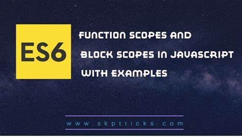

# Scope 
## Scope  ин область видимисти мебошад.  Яъне чои айёни вереблхо
## Чор намуди скоп дар Js маълум аст.

## 1. Global scope
```js
   let a = 5;

```
## 2. Function scope

## 3. Block scope

## 4. Module scope


# Hoisted
## Як механизмеай ки вакте мо дар JS ягон перемени месозем ура пешаки фарёд мекнем Hoisted мегуянд.

## Function declaration and Var veriables hoisted  мешаванд.
## Let and const and function expression hoissted намешаванд.


## let ва const block scope анд.  Ва Var Function scope мебошанд.
## Барои он ки лет ва конст да блочний скоп намегузаранд дар фанкшин скоп мегузаранд.

## Var бошад фанкшин скоп мебошад.Барои он ки вар дар фанкшин скоп намегузарад.Дар блочний скоп мегузарад.

## 2 намуди ошибка мавчуд аст. 
### 1. TypeError
### 2. Refference Error:
### 1. Вакте ки вереебла намеёба аму вакт хамин ошибка мебарояд.

```js
  is not defined
```
### 2. Вакте ки мо перемениа пеш ай хдш фарёд мекнем.
```js
    can not accec an intionaltzation
```
## TDZ- Temporal Dead zone