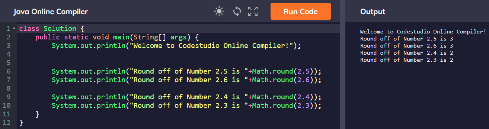
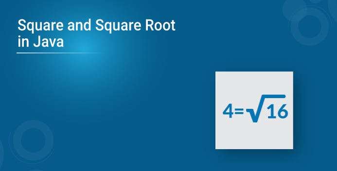

# Number 
## Ин ракам мебошад.Яъне число.
# Methods Of Number;
## 1. Math.Floor

### Ин метод астаткара намегира.
## 2. Math.Round

###  Агар нимта боша 1 хисобш мекна.
## 3. Math.Ceil

### Агар 1.00000001 боша ира 2 хисобш мекна
## 4. Math.Pow

### Дарачада мегира. Ду параметр мегира(2.10) резултать 1024.
## 5. Math.Sqrt

### Рещаи квадратида мегира.Як параметр мегира.
## 6. Math.Cbrt

### Решаи кубида мегира. Як параметр мегира.
## 7. Math.Abs

### И адади минусара пилуса мекна.
## 8. Math.Max

### Адади калона ай ададхо миёва.
## 9. Math.Min

### Адади майдара ай байни ададхо миёва.
## 10. Math.Random
### Случайни число миёба.

## 11. Math.isNaN
### И муайян мекна ки адади мо Number хастай ё не. Резултатш боша True and False мебошад.Як параметр кабул мекна.