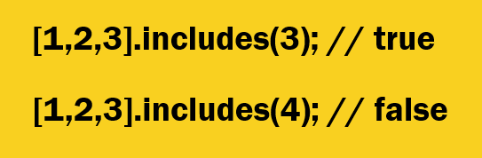

# Array

# Масив чист?

## Массив ин як калексияе мебошад,ки да дарунш якчанд значения мегира.

# Тарзи сохтани массив дар Js let arr=[1,2,3,'hello',true];

# Методхои бе калбекдори Array;

## 1. Pop

### Охиронги елементи массива удалит мекна. Ягон параметр намегира.

## 2. Shift

### Якмги елементи массива удалит мекна.Ягон параметр намегира.

## 3. Push

### И удалит намекнан набарот ягончи дабавит мекна.Чандтаи бфорамон дабавит мекна. Ай охирон дабавит мекна.

## 4. Unshift

### И удалит намекнан набарот ягончи дабавит мекна.Чандтаи бфорамон дабавит мекна. Ай аввал дабавит мекна.

## 5. Concat

### Ин метод барои якчанд массива мечаспонем.

## 6. Slice

### Ай кчо то кчои масиива метонем бгирем таввасутит слайс.

## 7. Splice

### И ранги слайсай бо якори дигарам мекна. 3 параметр мегира. Якмш ай кчо сар щава , 2юмш Чандта удалить кнем, 3юмш чанд дабавить кнем.

## 8. toString

### Метона яюбой массива стринг кна.Ягон параметр намегира.

## 9. Join

### Ранги ай стрига зуртарай. агар мо бхохем ки хамаш дар якдигар бчаспа "" мемонем.

## 10. Includes

### И ай даруни массив мекова агар ёфт true мега

## 11. IndexOf

### Ай номш малум аст. Барои индекси масивора ёфтан. Як параметр мегира.

## 12. Reverse

### Методи реверс мегира чапана мекна. неки 1 праблема дора, Масиви асосира алиш мекна.

## 13. toReverse

### Методи реверс мегира чапана мекна. Методи навай. Массиви асосира Иваз намекна.

# Методхои калбекдори Array.

## Методхои клбекдор дар даруни параметр калбек мегира. Arr.forEach(()=>{})

## Calbek-Ин як функсия мебошад. 3 параметр мегира.

## 1. forEach

### И ранги for-ай неки алтернатившай. Ретурн надора.\

## 2. map

### Як методай ки мода масиви нав мета. Масиви асосира иваз намекна. Ретурн дора.

## 3. Find

### Ретурн дора. И Мода як елементеи ки мо мехохем мета. Як та меброра.

## 4. Filter

### Як елемент неву чандтаи ёфт мода меброра дар массив. Ритурн дора. Масив карда меброра.

## 5. toSorted

### Елементора по парядка мемома.

## 6. Reduce

### Ин метод 2 параметр кабул мекна. 1мш калбек, 2юмш Инитиал СТЕК.Началний састаяние. ВА калбеки и боша 4 параметр кабул мекна. Ретурн дора.

# Destructuring

## Ин як механизмеай ки кори мора осон мекна.Тарзи сохтани Destructuring

## let [el1,,,,el4]

# Spread

## ин як механизмеай ки кори мора осон мекна. Синтаксиси сприд 3 нукта мебошад(...).Тарзи сохтани сприд:

### let arr2=[...arr]

# Rest

## Ин як механизмеай ки дар функсия истифодаш мекнем.Дар вакти ки мо намедонем чандта параметр мия дар функсия мо рест истифода мекнем.Рест мода массив ретурн мекна.

# function name(...arr){

}

